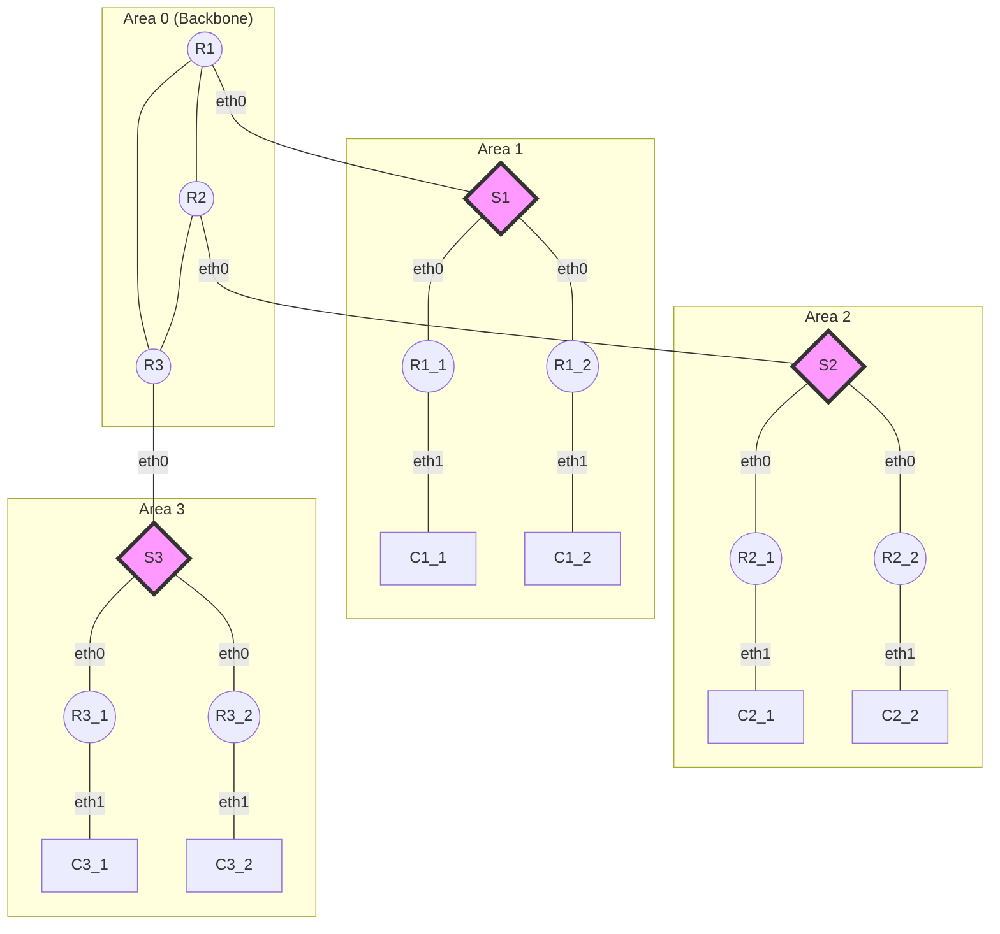

# Intra Domain Routing OSPF Single Area and Multi Area

This repository contains a Python script (`ospf-lab.py`) that simulates an OSPF (Open Shortest Path First) network using Mininet. The script creates a topology with multiple routers and hosts, demonstrating both single-area and multi-area OSPF configurations.

## Requirements

- Python 3
- Mininet
- FRRouting (FRR)

## Usage

To run the OSPF lab simulation:

```bash
sudo python3 ospf-lab.py
```

## Topology

The script creates a network topology with three subnets, each containing a main router, a switch between the main router and two sub-routers, and two client hosts. The main routers are interconnected to form the backbone of the network.

### Multi-Area OSPF

In multi-area OSPF, the network is divided into multiple areas, with Area 0 serving as the backbone. This configuration improves scalability and reduces the processing load on routers.



## Network Components

- R1, R2, R3: Main routers (Area Border Routers in multi-area configuration)
- R1_1, R1_2, R2_1, R2_2, R3_1, R3_2: Sub-routers
- C1_1, C1_2, C2_1, C2_2, C3_1, C3_2: Client hosts
- S1, S2, S3: Switches connecting routers within each subnet

## Configuration

The script generates configuration files for each router using templates. These configurations are stored in the specified directory and are used to set up OSPF routing on the routers.

## Customization

You can modify the `OSPFLab` class in the script to adjust the network topology, IP addressing, or OSPF areas as needed for your specific requirements.

## Note

This lab is designed for educational purposes and may need additional configuration for production use. Ensure you have the necessary permissions and understanding of OSPF before deploying in a live environment.

## ADDITIONAL CONFIGURATION !
```bash
sudo nano /etc/sysctl.conf
```
Uncomment this section :
```bash
net.ipv4.ip_forward=1
net.ipv6.conf.all.forwarding=1
```

And, config this too :
```bash
sudo modprobe bridge
sudo modprobe br_netfilter
```

The command :
```bash
lsmod | grep bridge
```
```bash
bridge                335872  1 br_netfilter
stp                    12288  1 bridge
llc                    16384  2 bridge,stp
```

example results when running the ospf-lab.py :
```bash
========================================
Warning: Linux bridge may not work with net.bridge.bridge-nf-call-arptables = 1
Warning: Linux bridge may not work with net.bridge.bridge-nf-call-iptables = 1
Warning: Linux bridge may not work with net.bridge.bridge-nf-call-ip6tables = 1
Finished initializing network in: 1.1319239139556885 seconds
```

## Tugas Intra-domain Routing dengan OSPF Single Area dan Multi Area - Mininet

Skenario percobaan 1: keseluruhan router menjalankan OSPF single-area

Skenario percobaan 2: menjalankan OSPF multi-area

*PENTING UNTUK DIBACA BAGIAN INI !*

**Untuk Skenario 2, jalankan saja langsung repository ini tanpa mengubah apapun**

**Untuk Skenario 1, lakukan perubahan pada masing masing frr-config pada Router, perubahan yang dilakukan adalah mengubah seluruh area menjadi area 0 (Single Area), lakukan perubahan melalui VS Code** :

### frr.conf R1
```bash
frr version 8.5.4
frr defaults traditional
hostname R1
service integrated-vtysh-config
!
interface R1-eth0
 ip ospf network broadcast
 ip address 10.11.1.1/24
exit
!
interface R1-eth1
 ip address 10.10.1.1/24
exit
!
interface R1-eth2
 ip address 10.10.2.1/24
exit
!
router ospf
 ospf router-id 1.1.1.1
 network 10.11.1.0/24 area 0
 network 10.10.1.0/24 area 0
 network 10.10.2.0/24 area 0
exit
!
line vty
```

### frr.conf R1_1
```bash
frr version 8.5.4
frr defaults traditional
hostname R1_1
service integrated-vtysh-config
!
interface R1_1-eth0
 ip ospf network broadcast
 ip address 10.11.1.2/24
exit
!
interface R1_1-eth1
 ip address 172.16.1.1/24
exit
!
router ospf
 ospf router-id 1.1.1.2
 network 10.11.1.0/24 area 0
 network 172.16.1.0/24 area 0
exit
!
line vty
```

### frr.conf R1_2
```bash
frr version 8.5.4
frr defaults traditional
hostname R1_2
service integrated-vtysh-config
!
interface R1_2-eth0
 ip ospf network broadcast
 ip address 10.11.1.3/24
exit
!
interface R1_2-eth1
 ip address 172.16.2.1/24
exit
!
router ospf
 ospf router-id 1.1.1.3
 network 10.11.1.0/24 area 0
 network 172.16.2.0/24 area 0
exit
!
line vty
```

### frr.conf R2
```bash
frr version 8.5.4
frr defaults traditional
ipv6 forwarding
hostname R2
service integrated-vtysh-config
!
interface R2-eth0
 ip address 10.12.1.1/24
exit
!
interface R2-eth1
 ip address 10.10.1.2/24
exit
!
interface R2-eth2
 ip address 10.10.3.2/24
exit
!
router ospf
 ospf router-id 2.2.2.1
 network 10.12.1.0/24 area 0
 network 10.10.1.0/24 area 0
 network 10.10.3.0/24 area 0
exit
!
line vty
```

### frr.conf R2_1
```bash
frr version 8.5.4
frr defaults traditional
ipv6 forwarding
hostname R2_1
service integrated-vtysh-config
!
interface R2_1-eth0
 ip address 10.12.1.2/24
exit
!
interface R2_1-eth1
 ip address 172.17.1.1/24
exit
!
router ospf
 ospf router-id 2.2.2.2
 network 10.12.1.0/24 area 0
 network 172.17.1.0/24 area 0
exit
!
line vty
```

### frr.conf R2_2
```bash
frr version 8.5.4
frr defaults traditional
ipv6 forwarding
hostname R2_2
service integrated-vtysh-config
!
interface R2_2-eth0
 ip address 10.12.1.3/24
exit
!
interface R2_2-eth1
 ip address 172.17.2.1/24
exit
!
router ospf
 ospf router-id 2.2.2.3
 network 10.12.1.0/24 area 0
 network 172.17.2.0/24 area 0
exit
!
line vty
```

### frr.conf R3
```bash
frr version 8.5.4
frr defaults traditional
hostname R3
service integrated-vtysh-config
!
interface R3-eth0
 ip address 10.13.1.1/24
exit
!
interface R3-eth1
 ip address 10.10.2.2/24
exit
!
interface R3-eth2
 ip address 10.10.3.1/24
exit
!
router ospf
 ospf router-id 3.3.3.1
 network 10.13.1.0/24 area 0
 network 10.10.2.0/24 area 0
 network 10.10.3.0/24 area 0
exit
!
line vty

```

### frr.conf R3_1
```bash
frr version 8.5.4
frr defaults traditional
hostname R3_1
service integrated-vtysh-config
!
interface R3_1-eth0
 ip address 10.13.1.2/24
exit
!
interface R3_1-eth1
 ip address 172.18.1.1/24
exit
!
router ospf
 ospf router-id 3.3.3.2
 network 10.13.1.0/24 area 0
 network 172.18.1.0/24 area 0
exit
!
line vty

```

### frr.conf R3_2
```bash
frr version 8.5.4
frr defaults traditional
hostname R3_2
service integrated-vtysh-config
!
interface R3_2-eth0
 ip address 10.13.1.3/24
exit
!
interface R3_2-eth1
 ip address 172.18.2.1/24
exit
!
router ospf
 ospf router-id 3.3.3.3
 network 10.13.1.0/24 area 0
 network 172.18.2.0/24 area 0
exit
!
line vty

```

# LAPORAN 
[Tugas Intra-domain Routing_225150201111009_DANI ADRIAN.pdf](https://github.com/user-attachments/files/17355866/Tugas.Intra-domain.Routing_225150201111009_DANI.ADRIAN.pdf)


